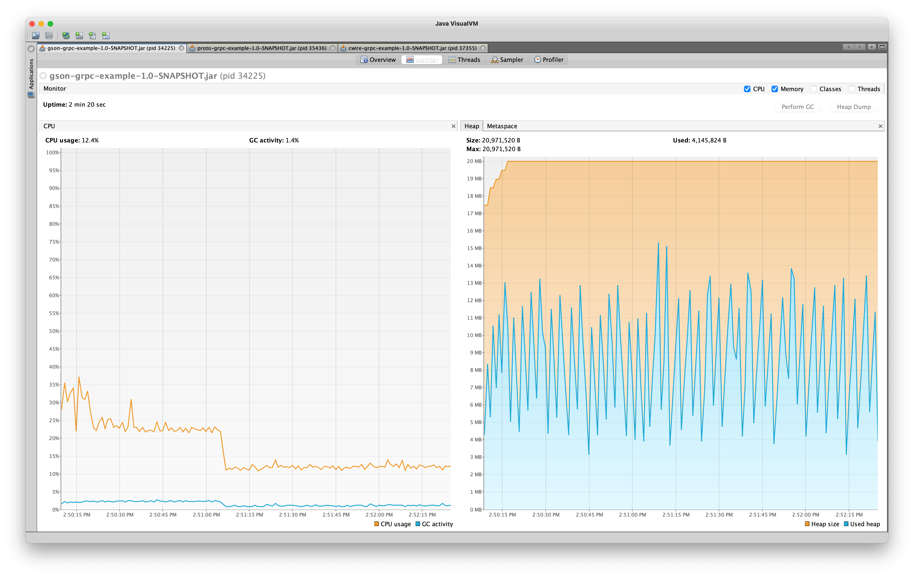
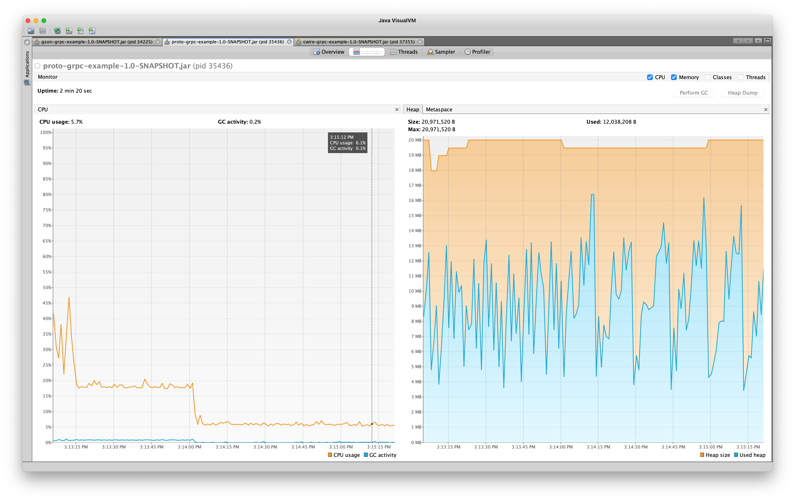
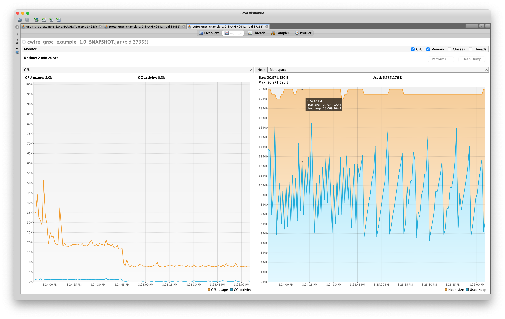

+++
title = 'Gson vs Proto vs Chronicle Wire Race over 20MB Heap'
date = '2024-11-21T15:10:54+05:30'
draft = false
+++

# Intro

In my last [article](../chronicle-wire-grpc-exp3/), I tested chronicle wire serialisation within gRPC backend. The idea was a requisite for an other idea of comparing serialising performance of protocol buffers wrt chronicle wire. This is the demo for the original idea. The performance of chronicle wire is expected better or at par to protocol buffer owing to lesser GC time they pose at scale. Let's find out. I am also including gson as a third approach.

# Setup
- Macbook Pro late 2016 A1707
- jdk 1.8.0_131; mvn 3.9.9
- Source Code is hosted across git branches at 
	- [protocol buffer](https://github.com/sumit-mundra/cwire-grpc-example/tree/proto-setup)
	- [gson](https://github.com/sumit-mundra/cwire-grpc-example/tree/gson) and 
	- [chronicle-wire](https://github.com/sumit-mundra/cwire-grpc-example/tree/main) 

# Method

There are smaller key nuances from earlier setup. 
- For protocol buffer, stubs generated by grpc dependencies is used.
- For gson, Google Gson library is used. 
- For chronicle wire, the dependency remain same as before.
- The overall setup was run with 256MB heap and 20MB heap.
- `jvisualvm` ( A tool available with any jdk under `bin` folder, if `JAVA_HOME` is not added to your terminal `path` ) was used to visualise the overall execution by manual attachment from local available jvms.
- We kept dependencies to a minimum in comparison to a gRPC backend in case of *gson* and *chronicle wire* to ensure no `protoc` related components come in play.

## To run at your local
1. clone the repository with appropriate branch

2. In a terminal from cloned directory, for 20m heap version, run
    ```
    mvn clean package;
    java -XmX20m -jar <<jar_name>>
    ```
    `<<jar_name>>` would be path to jar file under target folder which varies with each branch to emphasise the serialisation approach under evaluation. 

3. For no heap restraints, just run with `java -jar <<jar_name>>`, which defaults to 256MB heap space for JVM execution on most platforms.

# Results

## 256MB heap space

### Gson

``` text
Started
Clients, RPCs, RPCs/s, sum(us), avg(us), simulated_delay(us), delta(us)
   1,  42260,  4226.00,  9736536.00,   230.40,    0,   230.40
  10,  63205,  6320.50,  9732312.00,   153.98,    0,   153.98
 100,  70099,  7009.90,  9747041.00,   139.05,    0,   139.05
   1,   5343,   534.30,  9944053.00,  1861.14,    1,  1860.14
  10,   5254,   525.40,  9942504.00,  1892.37,    1,  1891.37
 100,   5305,   530.50,  9944886.00,  1874.63,    1,  1873.63
   1,   5308,   530.80,  9947248.00,  1874.01,   10,  1864.01
  10,   5357,   535.70,  9945561.00,  1856.55,   10,  1846.55
 100,   5450,   545.00,  9946294.00,  1825.01,   10,  1815.01
   1,   5354,   535.40,  9943622.00,  1857.23,  100,  1757.23
  10,   5556,   555.60,  9943755.00,  1789.73,  100,  1689.73
 100,   5474,   547.40,  9945566.00,  1816.87,  100,  1716.87
   1,   5494,   549.40,  9945327.00,  1810.22, 1000,   810.22
  10,   5525,   552.50,  9945601.00,  1800.11, 1000,   800.11
 100,   5525,   552.50,  9944750.00,  1799.95, 1000,   799.95
```

### Protocol Buffer

``` text
Started
Clients, RPCs, RPCs/s, sum(us), avg(us), simulated_delay(us), delta(us)
   1,  44625,  4462.50,  9761497.00,   218.75,    0,   218.75
  10,  68671,  6867.10,  9744719.00,   141.90,    0,   141.90
 100,  76581,  7658.10,  9764094.00,   127.50,    0,   127.50
   1,   5598,   559.80,  9945321.00,  1776.58,    1,  1775.58
  10,   5657,   565.70,  9944985.00,  1758.00,    1,  1757.00
 100,   5521,   552.10,  9948026.00,  1801.85,    1,  1800.85
   1,   5699,   569.90,  9949572.00,  1745.85,   10,  1735.85
  10,   5775,   577.50,  9943718.00,  1721.86,   10,  1711.86
 100,   5611,   561.10,  9945468.00,  1772.49,   10,  1762.49
   1,   5707,   570.70,  9950722.00,  1743.60,  100,  1643.60
  10,   5643,   564.30,  9941928.00,  1761.82,  100,  1661.82
 100,   5720,   572.00,  9947590.00,  1739.09,  100,  1639.09
   1,   5965,   596.50,  9951740.00,  1668.36, 1000,   668.36
  10,   5779,   577.90,  9945072.00,  1720.90, 1000,   720.90
 100,   5595,   559.50,  9944045.00,  1777.31, 1000,   777.31
```

### Chronicle Wire

``` text
Started
Clients, RPCs, RPCs/s, sum(us), avg(us), simulated_delay(us), delta(us)
Chronicle core loaded from file:/Users/sumitmundra/cwire.jar
   1,  32037,  3203.70,  9751227.00,   304.37,    0,   304.37
  10,  63645,  6364.50,  9735888.00,   152.97,    0,   152.97
 100,  70368,  7036.80,  9760252.00,   138.70,    0,   138.70
   1,   5473,   547.30,  9947489.00,  1817.56,    1,  1816.56
  10,   5480,   548.00,  9945050.00,  1814.79,    1,  1813.79
 100,   5485,   548.50,  9950388.00,  1814.11,    1,  1813.11
   1,   5534,   553.40,  9943875.00,  1796.87,   10,  1786.87
  10,   5450,   545.00,  9947767.00,  1825.28,   10,  1815.28
 100,   5389,   538.90,  9947432.00,  1845.88,   10,  1835.88
   1,   5426,   542.60,  9948055.00,  1833.40,  100,  1733.40
  10,   5400,   540.00,  9949638.00,  1842.53,  100,  1742.53
 100,   5908,   590.80,  9943036.00,  1682.98,  100,  1582.98
   1,   5697,   569.70,  9947363.00,  1746.07, 1000,   746.07
  10,   5611,   561.10,  9950419.00,  1773.38, 1000,   773.38
 100,   5515,   551.50,  9945898.00,  1803.43, 1000,   803.43
```

## 20MB heap space

### Gson
``` text
cwire-grpc-example git:(gson) ✗ java -jar -Xmx20m target/gson-grpc-example-1.0-SNAPSHOT.jar 
Started
Clients, RPCs, RPCs/s, sum(us), avg(us), simulated_delay(us), delta(us)
   1,   4174,   417.40,  9657203.00,  2313.66,    0,  2313.66
   1,   6591,   659.10,  9614727.00,  1458.77,    0,  1458.77
   1,   7442,   744.20,  9600710.00,  1290.07,    0,  1290.07
 100,   7544,   754.40,  9613064.00,  1274.27,    0,  1274.27
 500,   7516,   751.60,  9611223.00,  1278.77,    0,  1278.77
1000,   7473,   747.30,  9623223.00,  1287.73,    0,  1287.73
   1,   3005,   300.50,  9762260.00,  3248.67,  100,  3148.67
 100,   3119,   311.90,  9776693.00,  3134.56,  100,  3034.56
 500,   3210,   321.00,  9781170.00,  3047.09,  100,  2947.09
1000,   3065,   306.50,  9758947.00,  3184.00,  100,  3084.00
   1,   3024,   302.40,  9782488.00,  3234.95, 1000,  2234.95
 100,   3106,   310.60,  9730190.00,  3132.71, 1000,  2132.71
 500,   3134,   313.40,  9779656.00,  3120.50, 1000,  2120.50
1000,   3089,   308.90,  9794796.00,  3170.86, 1000,  2170.86
```
[](./gson-visualvm.png)

### Protocol Buffer

``` text
➜  cwire-grpc-example git:(proto-setup) ✗ java -jar -Xmx20m target/proto-grpc-example-1.0-SNAPSHOT.jar
Started
Clients, RPCs, RPCs/s, sum(us), avg(us), simulated_delay(us), delta(us)
   1,  15063,  1506.30,  9849362.00,   653.88,    0,   653.88
   1,  28040,  2804.00,  9842059.00,   351.00,    0,   351.00
   1,  30572,  3057.20,  9869940.00,   322.84,    0,   322.84
 100,  30794,  3079.40,  9878362.00,   320.79,    0,   320.79
 500,  29124,  2912.40,  9877760.00,   339.16,    0,   339.16
1000,  30211,  3021.10,  9881428.00,   327.08,    0,   327.08
   1,   4652,   465.20,  9946455.00,  2138.10,  100,  2038.10
 100,   4604,   460.40,  9945649.00,  2160.22,  100,  2060.22
 500,   4661,   466.10,  9947857.00,  2134.28,  100,  2034.28
1000,   4650,   465.00,  9945394.00,  2138.79,  100,  2038.79
   1,   4988,   498.80,  9947907.00,  1994.37, 1000,   994.37
 100,   5136,   513.60,  9946025.00,  1936.53, 1000,   936.53
 500,   5334,   533.40,  9949009.00,  1865.21, 1000,   865.21
1000,   5334,   533.40,  9948533.00,  1865.12, 1000,   865.12
```
[](./proto-visualvm.png)

### Chronicle Wire

``` text
➜  cwire-grpc-example git:(main) ✗ java -jar -Xmx20m target/cwire-grpc-example-1.0-SNAPSHOT.jar 
Started
Clients, RPCs, RPCs/s, sum(us), avg(us), simulated_delay(us), delta(us)
Chronicle core loaded from file:/Users/sumitmundra/poc_projects/cwire-grpc-example/target/cwire-grpc-example-1.0-SNAPSHOT.jar
   1,   6723,   672.30,  9542590.00,  1419.39,    0,  1419.39
   1,  14398,  1439.80,  9336154.00,   648.43,    0,   648.43
   1,  15919,  1591.90,  9303377.00,   584.42,    0,   584.42
 100,  16739,  1673.90,  9325887.00,   557.14,    0,   557.14
 500,  16672,  1667.20,  9298271.00,   557.72,    0,   557.72
1000,  13887,  1388.70,  9344829.00,   672.92,    0,   672.92
   1,   4146,   414.60,  9710747.00,  2342.20,  100,  2242.20
 100,   4124,   412.40,  9734786.00,  2360.52,  100,  2260.52
 500,   3930,   393.00,  9728737.00,  2475.51,  100,  2375.51
1000,   3947,   394.70,  9737211.00,  2466.99,  100,  2366.99
   1,   3889,   388.90,  9730409.00,  2502.03, 1000,  1502.03
 100,   3878,   387.80,  9735514.00,  2510.45, 1000,  1510.45
 500,   4102,   410.20,  9707126.00,  2366.44, 1000,  1366.44
1000,   4174,   417.40,  9730980.00,  2331.33, 1000,  1331.33
```
[](./cwire-visualvm.png)

To understand more on columns details, please refer [previous](../chronicle-wire-grpc-exp3/) blog.

- Two columns are of particular interest in tabular data:
	- The third column provides **average RPC/s** achieved in the iteration.
	- The last column tells *extra delay* (from system + code) barring simulated thread sleep delay. It mostly includes transport layer and serialisation related execution time.

There are two focus points in the images : 
- The blue line in the graph on the left side represents cpu usage by jvm GC thread.
- The bigger spikes in heap memory usage represents a GC cycles triggered.


# Takeaways
- Chronicle Wire brings almost comparable performance as protocol buffer under no heap stress.
- Under no delay, Gson serialisation took almost twice GC CPU. 2.5% cpu  in comparison to ~1%(cwire) and 0.9%(protoc). This is further evident with more count of spikes in Gson visualvm snapshot vs others.
- As soon as there is a thread sleep delay (1ms), the jvm performance takes a hit, no matter what. ( My guess is jvm optimisation at cpu level cache gets wiped off after delay and thus cpu instructions are not executed off cache) cf. [Vanilla Java](http://blog.vanillajava.blog/2024/11/what-can-make-java-code-go-faster-and.html)
- Clearly, the gson serialisation is slowest candidate here. The delay from system barring simulated delay is largest in gson case, whereas it is comparable in protocol buffer and chronicle wire.
- Under larger free/total heap memory ratio use cases, the serialisation effects do not produce significant impact. However, this was a test utility and very often, in production, we reach gc boundary heap usage triggering gc at high throughput cases. For such APIs, configuring a binary serialiser could provide a great deal of performance boost from same metal resources (cpu and memory).
- The throughput under constraint for protocol buffer was the best. (RPC/s) 

*Overall Race Results: **proto ~> cwire >> gson***

