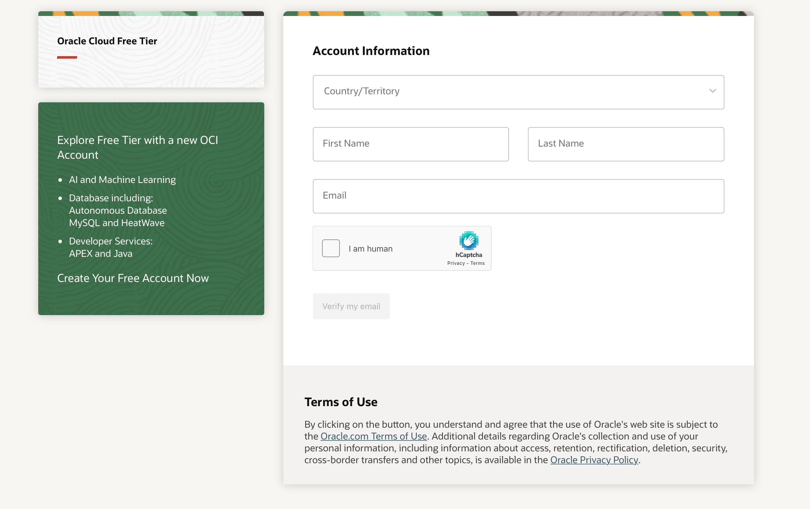

+++
title = 'Your Free And Personal VPN - Part 1'
date = '2024-11-27T18:17:48+05:30'
draft = true
+++

These days, there are a lot of free as well as paid VPN services available. While the paid ones are reliable, free VPN often is limited by bandwidth and requires frequent configuration changes. But, what if I told you that building a VPN from ground up is no more a delicate job. I recently created a free VPN server for myself too. The goal was to connect my home devices (which are behind a Double NAT from ISP) to a VPN machine for remote access. But first, we need a server that holds on to a public IP with good bandwidth limits. For oracle cloud free instance, it is [10TB/month ](https://docs.oracle.com/en-us/iaas/Content/FreeTier/freetier_topic-Always_Free_Resources.htm#resources)

After a quick research across all available cloud providers, I chose Oracle Cloud "Always Free" tier resources. As my primary use-case would be VPN access, I did not want to compromise on available data(in/out) bandwidth. Oracle cloud had the largest bandwidth of them all. 

In this post, we shall first learn to create a suitable cloud instance, of course, for free.

Follow along these steps to create an instance:
1. **Sign up**: Create an account at https://www.oracle.com/in/cloud/sign-in.html. If you already have one account, you can use the same as well. Note that, you can change the country / region by clicking the flag icon in top bar towards top right. It might also be helpful to setup 2FA during the sign up process. 
{{ $image := .Resources.Get "00SignUp.png" }}
2. **Auth Landing Page:** Once the tenant is setup to a region, a corresponding auth landing page would show up. For me it is like this. After providing login details and 2FA (two-factor authentication), you would land to Get Started page.

3. **Create a VM instance:** Under Launch resources section, you might find "Create a VM instance" template. Click and follow up for a quick-start.
4. **Compartments:** Oracle cloud organises your cloud account under compartments, with default being 'root'. On the "create instance" page, you can edit details of the instance you want to spin up. For 1 month, Oracle also provides premium services for trial, however, for our exercise, we would be choosing always free tier resources only.
5. **Placement:** Under "Placement", under *advanced option*, ensure you are using "*on-demand capacity*". Choose the data centre location best for you (in general,  proximal wins). For free tier, there may be some limitations in zone list. 
6. **Image and Shape:** Click "edit" option under "Image and Shape", choose for shape(CPU) and OS image ( image). I chose "VM.Standard.E2.1.Micro" which is always free and Ubuntu 24.04 OS for this machine.

7. **Primary VNIC:** I skimmed past "Primary VNIC information" as defaults were good. Enable automatic allocation of both private and a public IPv4 under "Primary VNIC IP addresses".

8. **SSH:** You should add ssh keys to connect via a terminal to the cloud machine. Or you can generate one under "Add SSH keys" option.
9. **Launch:** Click the "Create" button at the bottom. Your cloud instance must launch in a minute. 

In my next article, I'll detail how to setup this machine as a free private VPN server.