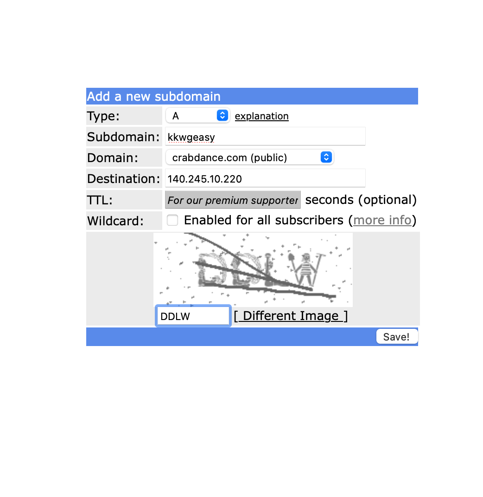

+++
title = 'Your Free And Personal VPN - Part 2'
date = '2024-12-07T00:31:24+05:30'
draft = false
+++

## Prologue
In previous [blog](../setup-vpn-server-part-1/), we launched a free-to-use cloud server (of course, in agreement with terms and conditions of oracle cloud). This server has 
- enough compute power to act as a router for our home IoT devices.
- enough bandwidth quota to transfer continuous data between devices.

In this blog, we will further enhance the connectivity of this server from external world, and proceed towards actually implementing a VPN server. There are many VPN technologies available, the simple choice we made is Wireguard VPN.

I tried to implement wireguard setup without containerisation. It is easy and recommended approach if your goal is to study wireguard as a technology. These articles were very helpful in my research:
* https://www.procustodibus.com/blog/2020/10/wireguard-topologies/#hub-and-spoke
* https://www.procustodibus.com/blog/2021/01/wireguard-endpoints-and-ip-addresses/
* https://www.procustodibus.com/blog/2020/11/wireguard-hub-and-spoke-config/

However, for simplicity, I find that a containerised approach warrants better repeatability. 

## Set Up Wireguard and Nginx Reverse Proxy

Let's get started. (These steps should take anywhere between 20mins to 40mins to complete)

### 1. Setup network and connectivity
Wireguard is p2p VPN approach. But, we would be using our cloud server to also act as a router for our other devices **to beat double NAT** from our ISP. Further, to be able to connect more devices on-the-fly, we need a secure https server running, so we would open up ports 80 and 443 for this cloud server as well
- TCP 80
- TCP 443
- UDP 51820

#### Specific to Oracle Cloud 
Log in to oracle cloud sign in portal. (Do not bookmark log in page, use https://www.oracle.com/in/cloud/sign-in.html as starting point.) With the tenant name, and sign in details, you should land to the cloud portal home page. You might need MFA passcodes, if applicable. You would land to the "Get Started" home page tab.
[](./01sign%20in.png) 

Next, from the hamburger menu, choose Compute -> choose Instances.
[](./02hamburger-compute.png) 

Click on the instance previously created, to land on to the instance detail page like below:
[](./03i-instance-details-subnet-link.png)

Click on subnet link in the details -> and then click on default security list in table shown
[](./04add-ingress-rules.png)

Add three rules for three ports mentioned above. Note the underlying protocol as TCP and UDP also.
[](./05http-ingressrule1.png)
[](./06udp-ingressrulle2.png)

### 2. Install docker ce and docker compose
Now that we have the networking setup, we can move towards installing required softwares for containers based approach. 
Follow along this documentation for docker installation on Ubuntu: 
> https://docs.docker.com/engine/install/ubuntu/

Tip: Check docker with `sudo docker run hello-world` and check docker compose installation with `docker compose version`

### 3. Run wireguard and wg-easy with nginx reverse proxy
Wireguard requires access to kernel level network layers. So we would also need relevant capabilities in our docker containers configurations. 
This approach by `Emile Nijssen` is simplest FOSS alternative I could find for administrating wireguard vpn network. Follow the instructions on 
> https://github.com/wg-easy/wg-easy/wiki/Using-WireGuard-Easy-with-nginx-SSL 

I approached these steps with some tweaks:
* I copied the files `docker-compose.yml` and `wg-easy.conf` in `ubuntu` user home directory.
* For domain, I used my [freedns](http://freedns.afraid.org) account to create a subdomain DNS entry of `A` kind pointing to this server's IP
[](./07freedns-domain.png)
* I created password hash as mentioned here https://github.com/wg-easy/wg-easy/blob/master/How_to_generate_an_bcrypt_hash.md . It mentions towards the end, that we need to replace `$` with `$$` and remove all quotes `'` to make it work.
``` sh
root@wgeasy:/home/ubuntu# docker run --rm -it ghcr.io/wg-easy/wg-easy wgpw 'myPass@1234' | sed -e 's/\$/$$/g' | sed -e "s/'//g"
PASSWORD_HASH=$$2a$$12$$5IPmgjjhdlJmJNDqXhu.zuRSVMM91AcsrumHtmY8.PyyWpqp0aqCe
```
* I edited the files with host-names with the created subdomain name at freedns (eg. `kkwgeasy.crabdance.com` in pic above) 

docker-compose.yml :
``` yaml
services:
  wg-easy:
    environment:
      # ⚠️ Change the server's hostname (clients will connect to):
      - WG_HOST=kkwgeasy.crabdance.com

      # ⚠️ Change the Web UI Password:
      #- PASSWORD=foobar123
      - PASSWORD_HASH=$$2a$$12$$9C9z9KrSIJgrQETFYqXSH.3h10kR3/3FR2ITwy2YtNE.3ry70kSSa
    image: ghcr.io/wg-easy/wg-easy
    container_name: wg-easy
    hostname: wg-easy
    volumes:
      - ~/.wg-easy:/etc/wireguard
    ports:
      - "51820:51820/udp"
    restart: unless-stopped
    cap_add:
      - NET_ADMIN
      - SYS_MODULE
    sysctls:
      - net.ipv4.ip_forward=1
      - net.ipv4.conf.all.src_valid_mark=1

  nginx:
    image: weejewel/nginx-with-certbot
    container_name: nginx
    hostname: nginx
    volumes:
      - ./.nginx/servers/:/etc/nginx/servers/
      - ./.nginx/letsencrypt/:/etc/letsencrypt/
    ports:
      - "80:80/tcp"
      - "443:443/tcp"
    restart: unless-stopped
```
And also in the nginx conf file:
``` nginx
server {
    server_name kkwgeasy.crabdance.com;

    location / {
        proxy_pass http://wg-easy:51821/;
        proxy_http_version 1.1;
        proxy_set_header Upgrade $http_upgrade;
        proxy_set_header Connection "Upgrade";
        proxy_set_header Host $host;
    }
}
```
Note that,
* I modified the `~/.nginx/servers/wg-easy.conf` nginx config file to reflect correct path relative to where `docker compose up -d` is executed. ( eg. `./.nginx/servers/wg-easy.conf` in this case )
* Do not forget to replace ⚠️ marked values everywhere( 2 in docker compose, 1 in nginx config and 1 in follow up commands for certbot setup)

Let's get the containers running:
``` sh
sudo su -
docker compose up -d
```

Now, we would deploy nginx reverse proxy config to nginx server with certbot setup:
``` shell
root@wgeasy:/home/ubuntu# docker exec -it nginx /bin/sh
/ # cp /etc/nginx/servers/wg-easy.conf /etc/nginx/conf.d/.
/ # certbot --nginx --non-interactive --agree-tos -m youremail@google.com -d kkwgeasy.crabdance.com
Saving debug log to /var/log/letsencrypt/letsencrypt.log
Requesting a certificate for kkwgeasy.crabdance.com

Successfully received certificate.
Certificate is saved at: /etc/letsencrypt/live/kkwgeasy.crabdance.com/fullchain.pem
Key is saved at:         /etc/letsencrypt/live/kkwgeasy.crabdance.com/privkey.pem
This certificate expires on 2025-03-06.
These files will be updated when the certificate renews.

Deploying certificate
Successfully deployed certificate for kkwgeasy.crabdance.com to /etc/nginx/conf.d/wg-easy.conf
Congratulations! You have successfully enabled HTTPS on https://kkwgeasy.crabdance.com

NEXT STEPS:
- The certificate will need to be renewed before it expires. Certbot can automatically renew the certificate in the background, but you may need to take steps to enable that functionality. See https://certbot.org/renewal-setup for instructions.

- - - - - - - - - - - - - - - - - - - - - - - - - - - - - - - - - - - - - - - -
If you like Certbot, please consider supporting our work by:
 * Donating to ISRG / Let's Encrypt:   https://letsencrypt.org/donate
 * Donating to EFF:                    https://eff.org/donate-le
- - - - - - - - - - - - - - - - - - - - - - - - - - - - - - - - - - - - - - - -
/ # nginx -s reload
2024/12/06 17:05:52 [warn] 46#46: conflicting server name "kkwgeasy.crabdance.com" on 0.0.0.0:80, ignored
nginx: [warn] conflicting server name "kkwgeasy.crabdance.com" on 0.0.0.0:80, ignored
2024/12/06 17:05:52 [notice] 46#46: signal process started
/ # exit
root@wgeasy:/home/ubuntu# 
```
Note that,

* You could also replace letsencrypt email as value to `-m` flag with your email. This shall send any communications to the email you mention. 
```certbot --nginx --non-interactive --agree-tos -m youremail@gmail.com -d yourdomain.com```
* You can further set certbot for auto renewal of certificates with a crontab entry for `certbot renew -q`.

### 4. Creating peers in VPN

Now, you must be able to access the wg-easy Web UI at `https://yourdomain.com`
[](./08i-wgeasy.png)
You can add as many new client you need. Note that, client is not correct term within wireguard VPN setups. We shall discuss more about it later. 

For use with mobile apps, an easy QR code options is available after client is created:
[](./08ii-qrcode.png)

At iOS app for wireguard, you can find these options under `+` menu to import config via QR code.
 [](./08iii-qrcodepeer.jpeg)

---

### 5. What's Next 
* If you want to hide your ip, you are good to go, all the traffic from your device routes through wireguard tunnel,
* If you want to use Wireguard VPN only to access your VPN devices, you can change allowed IPs setup
[](./09allowedips.jpeg)
from `0.0.0.0/0` to `10.8.0.0/24, <server_ip>/32`
* On demand activation provides auto activation feature with wifi or data.
* `Allowed IPs` act as filter for *inbound packets* and router for *outbound packets*
* You can edit nginx reverse proxy config to add further as many backends as you need while maintaining local servers in house. 

### 6. Bonus Tips
* For instance, I have a [jellyfin](https://jellyfin.org) server running on an old 2012 laptop with ubuntu server os. Now, I can access it over vpn just by making it a wireguard peer. Further, if I add it as a reverse proxy backend (much like wg-easy is already added) in nginx config using tunnel ips, I am able to access it over internet too.
* Yet another example, I installed [IP Webcam](https://play.google.com/store/apps/details?id=com.pas.webcam&hl=en) app on old phone. The double NAT from ISP restricted my internet access to this camera. But thanks to Wireguard, now I can reach this over internet. (Add as a peer, setup as a backend for nginx proxy or even set a new domain altogether, if needed.) Anyone in need of baby monitor or security camera ?
* A much under appreciated idea, you can rsync/ssh any folder on your mobile device on-the-fly to your HDD ( connected to a wired network WG peer at home). Google Storage quota reached, anyone?
* For instance, I could easily edit this line in an editor on my macbook (home wifi network), while accessing it via vpn using RealVNC on mobile ( using mobile data).